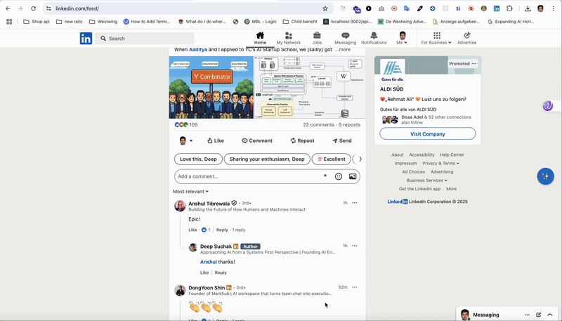
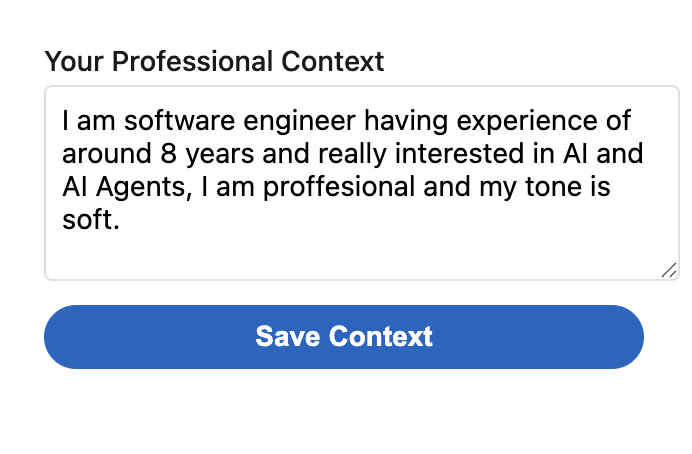

# LinkedIn Comment Enhancer

A Chrome extension that helps you generate and format professional LinkedIn comments using AI. The extension adds a magic button to LinkedIn posts that can generate new comments or format existing ones based on your professional context.

## Demo



## Features

- ✨ One-click comment generation
- 🎯 Context-aware responses based on your professional background
- 📝 Format existing comments to be more professional
- 🔄 Real-time comment updates
- 🎨 LinkedIn-native design

## Installation

1. Clone this repository:
```bash
git clone https://github.com/yourusername/linkedin-comment-enhancer.git
cd linkedin-comment-enhancer
```

2. Open Chrome and go to `chrome://extensions/`

3. Enable "Developer mode" in the top right

4. Click "Load unpacked" and select the extension directory


## Setup

1. Click the extension icon in your Chrome toolbar
2. Enter your professional context in the popup 

3. Click "Save Context" to generate your personalized system prompt


## Usage

### Generating New Comments

1. Navigate to any LinkedIn post
2. Click the "Comment" button
3. Click the ✨ button that appears on the right side 
4. Your AI-generated comment will appear in the comment box


### Formatting Existing Comments

1. Write your comment in the comment box
2. Click the ✨ button
3. Your comment will be reformatted to be more professional


## Development

### Project Structure

```
linkedin-comment-enhancer/
├── manifest.json
├── popup.html
├── popup.js
├── content.js
├── background.js
├── styles.css
└── icons/
    ├── icon16.png
    ├── icon48.png
    └── icon128.png
```

## Contributing

1. Fork the repository
2. Create your feature branch (`git checkout -b feature/amazing-feature`)
3. Commit your changes (`git commit -m 'Add some amazing feature'`)
4. Push to the branch (`git push origin feature/amazing-feature`)
5. Open a Pull Request

## License

This project is licensed under the MIT License - see the [LICENSE](LICENSE) file for details.

## Acknowledgments

- LinkedIn for the design inspiration
- OpenAI for the AI capabilities
- Chrome Extension API documentation